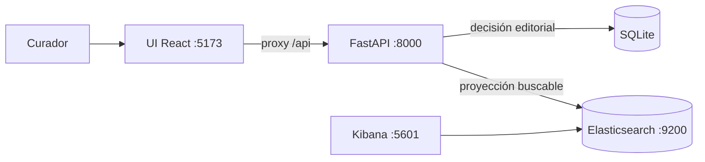

# Curaduría de terminología clínica sobre Elasticsearch

Proyecto personal de aprendizaje sobre Elasticsearch como **motor de búsqueda**:
analyzers, relevancia, facetas, autocompletado y el problema real de mantener un almacén
transaccional sincronizado con un índice derivado.

Un servicio FastAPI sobre dos almacenes — **SQLite** guarda la decisión editorial,
**Elasticsearch** guarda una proyección buscable de esa decisión — con una interfaz de
curaduría en React + TypeScript. El modelo de dominio es de conceptos clínicos tipo
SNOMED CT.

**Estado:** funcionando y verificado. 33 tests de integración en verde contra
Elasticsearch 9.5.3 real.


---

## El problema que resuelve

Un curador busca `hipertension`, sin tilde, porque así es como se escribe rápido. Si el
sistema no encuentra "Hipertensión arterial", el problema no es del curador.

Escribe `diabetis` con un error de tipeo: encuentra las tres diabetes. Escribe `EPOC`:
aparece el concepto correcto, aunque esa sigla no esté en el nombre completamente
especificado — está entre sus sinónimos.

Y cuando algo **no** aparece, hay un desplegable que muestra en qué tokens se partió la
consulta. Ahí está la explicación de todo lo anterior, y es la diferencia entre una
búsqueda que es una caja negra y una que se puede diagnosticar.

## Cómo levantarlo

Requisitos: Docker Desktop, Python 3.14 con el entorno `.vennv`, Node 22.

```powershell
cd D:\Repositorio\bigdata-elasticsearch

# 1. Infraestructura
docker compose up -d --pull never

# 2. Cargar el fixture (una sola vez)
.\.vennv\Scripts\python.exe -m scripts.seed --reset

# 3. API
.\.vennv\Scripts\python.exe -m uvicorn app.main:app --reload

# 4. UI, en otra terminal
cd ui
npm install
npm run dev
```

| Superficie | URL |
|---|---|
| UI de curaduría | <http://localhost:5173> |
| API y documentación interactiva | <http://127.0.0.1:8000/docs> |
| Estado del servicio | <http://127.0.0.1:8000/health> |
| Kibana | <http://localhost:5601>, usuario `elastic` |
| Elasticsearch | <http://localhost:9200>, mismas credenciales |

`--pull never` usa las imágenes ya descargadas. En una máquina nueva, traelas primero con
`docker compose pull`.

La contraseña sale de `ELASTIC_PASSWORD` en tu `.env` local. **No** uses `KIBANA_PASSWORD`:
esa es de la cuenta de servicio interna de Kibana. Una petición sin autenticar a
Elasticsearch debe devolver HTTP 401.

Vite escucha en `localhost`, que en Windows resuelve a IPv6. `http://127.0.0.1:5173` puede
no responder aunque el servidor esté arriba.

Para detener conservando los datos: `docker compose down`. **Evitá `down -v`**: borra los
volúmenes.

## Verificación

```console
$ .\.vennv\Scripts\python.exe -m pytest tests/ -q
33 passed, 2 warnings in 47.81s
```

Suite completa, sin exclusiones, contra el stack real. Son tests de **integración**:
necesitan Docker arriba. Usan su propio índice (`clinical-concepts-test`) y su propio
archivo SQLite en un directorio temporal, así que nunca tocan los datos de desarrollo.

Al 2026-09-06: 20 conceptos cargados y conciliados contra Elasticsearch 9.5.3, y la UI
verificada en navegador real a 1440px y 390px.

## Cómo está hecho



SQLite es la fuente de verdad. Elasticsearch es un índice **derivado**: si se borra
entero, se reconstruye. Los dos pueden divergir, y el sistema no promete que no lo hagan
— promete que la divergencia es **visible y reparable**. La franja superior de la UI
muestra ambos conteos permanentemente.

Tres decisiones que explican el resto del diseño:

1. **La fila se marca sucia antes de indexar.** Si el proceso muere entre los dos pasos,
   queda evidencia recuperable en lugar de deriva silenciosa.
2. **Un fallo de indexación no rechaza la edición.** El curador ya decidió; perder eso por
   una caída de Elasticsearch es peor que servir un índice atrasado un rato.
3. **Los filtros van en contexto `filter`, no en `must`.** Un filtro responde sí o no y no
   debe tocar el puntaje de relevancia. Hay un test que lo fija.

## Documentación

| Documento | Qué contiene |
|---|---|
| [architecture.md](docs/architecture.md) | Contexto, componentes, despliegue, secuencias, pipelines, flujo de curaduría y estados |
| [data-model.md](docs/data-model.md) | DER, esquema físico, el documento de Elasticsearch y su correspondencia |
| [prd.md](docs/prd.md) | Problema, requisitos con evidencia, criterios de aceptación, alcance y riesgos |
| [curation-api.md](docs/curation-api.md) | Endpoints, diseño del índice, analyzers y ejemplos con `curl` |
| [curation-ui.md](docs/curation-ui.md) | Componentes, decisiones de frontend y evidencia en navegador |
| [engineering-backlog.md](docs/engineering-backlog.md) | Qué falta para que esto sea software profesional, priorizado |
| [local-stack.md](docs/local-stack.md) | Configuración de Docker, límites de recursos y recuperación |
| [access-and-verification.md](docs/access-and-verification.md) | Evidencia de autenticación del stack |
| [presentation-verification.md](docs/presentation-verification.md) | Registro de verificación ejecutada |

## Estructura

```
app/          servicio FastAPI: modelos, índice, proyección, búsqueda, routers
ui/           interfaz React + TypeScript con Vite
scripts/      carga del fixture
seed/         20 conceptos clínicos de ejemplo
tests/        tests de integración contra el stack real
docs/         documentación y diagramas
compose.yaml  Elasticsearch + Kibana
```

## Entorno

- Python 3.14.6, entorno virtual en `.vennv`. Dependencias fijadas en `requirements.txt`
  (FastAPI, SQLAlchemy 2.0, cliente `elasticsearch` 9.5.0, pytest).
- Node 22.23.2 y npm 10.9.8, solo para la UI. React 18, TypeScript 5.7, Vite 6.
- Docker CLI 29.7.2, Compose 5.3.1, WSL 2.
- Windows 11 Pro, Ryzen 7 5700G, 31.3 GB de RAM.

Reconstruir el entorno de Python:

```powershell
.\.vennv\Scripts\python.exe -m pip install -r requirements.txt
```

## Alcance y límites

Es un laboratorio local. **Sin autenticación en la API**, un solo nodo de Elasticsearch,
solo HTTP y todo publicado en `127.0.0.1`. No lo expongas sin revisar antes el diseño de
despliegue.

El fixture de `seed/concepts.json` es un subconjunto ilustrativo en castellano. **No es
una distribución de SNOMED CT**, que requiere licencia de SNOMED International para
redistribuirse.

El repositorio arrancó con otro alcance — un laboratorio de eventos sintéticos de
e-commerce orientado a agregaciones y dashboards. Se descartó sin implementar; queda en
el commit `ddccbd0`.

Lo que falta para que esto sea software profesional está priorizado en el
[backlog de ingeniería](docs/engineering-backlog.md).

## Referencias oficiales

- [Text analysis](https://www.elastic.co/docs/manage-data/data-store/text-analysis)
- [Dynamic field mapping](https://www.elastic.co/docs/manage-data/data-store/mapping/dynamic-field-mapping)
- [Near-real-time search](https://www.elastic.co/docs/manage-data/data-store/near-real-time-search)
- [Docker installation](https://www.elastic.co/docs/deploy-manage/deploy/self-managed/install-elasticsearch-docker-basic)
- [Kibana version compatibility](https://www.elastic.co/docs/deploy-manage/deploy/self-managed/install-kibana-with-docker)
- [Clusters, nodes, and shards](https://www.elastic.co/docs/deploy-manage/distributed-architecture/clusters-nodes-shards)
