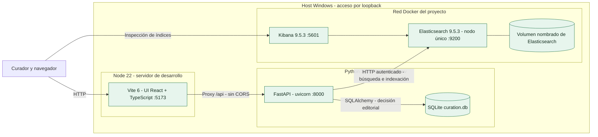
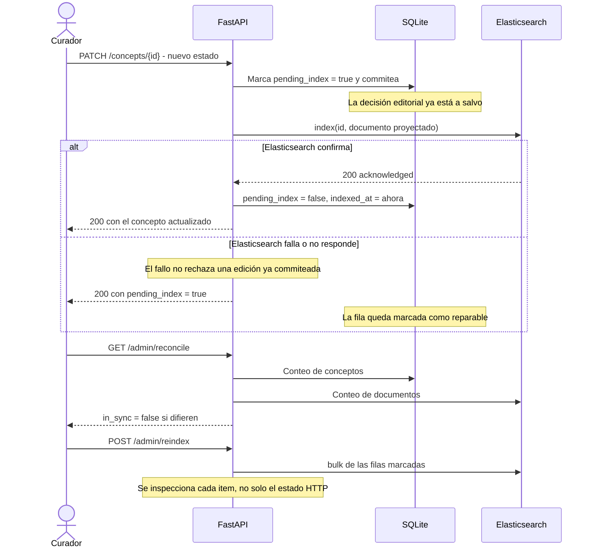
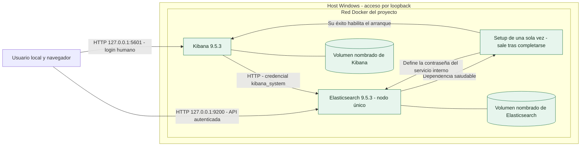
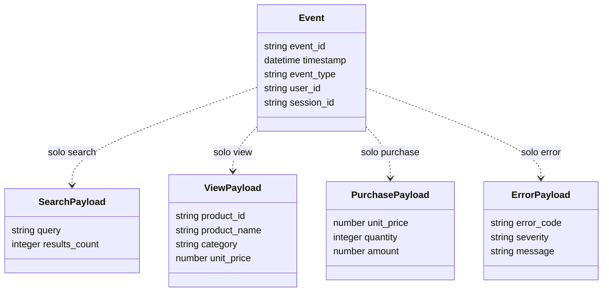

# Arquitectura y flujo del sistema

Actualizado el 2026-09-06.

El repo tiene dos sistemas sobre la misma infraestructura Docker:

- **Curaduría de terminología clínica** — construido y verificado. Secciones 1 y 2.
- **Infraestructura común** — Elasticsearch y Kibana en Docker. Sección 3.
- **Laboratorio de eventos sintéticos** — diseñado, sin implementar. Secciones 4 a 7.

Convención de color en los diagramas: **verde sólido** es lo que existe y corre;
**naranja punteado** es propuesta, no funcionalidad instalada.

Ver el [PRD](prd.md) para los criterios de aceptación, la
[API de curaduría](curation-api.md) para el diseño del índice, y el
[registro de acceso](access-and-verification.md) para la evidencia de autenticación.

## 1. Despliegue de la curaduría clínica

Verificado el 2026-09-06 corriendo de punta a punta: navegador → Vite → FastAPI →
SQLite y Elasticsearch.



SQLite guarda la decisión de curaduría: es la fuente de verdad editorial.
Elasticsearch guarda una **proyección** de esa decisión, optimizada para encontrarla.
Los dos pueden divergir, y por eso existe la sección 2.

Vite redirige `/api/*` a FastAPI y saca el prefijo, así el navegador ve un solo origen
y no hay CORS en desarrollo. Es también la forma en que un reverse proxy serviría a los
dos en producción.

Nada de la capa Python es específico de SQLite. Pasar a PostgreSQL es cambiar
`database_url` e instalar el driver.

## 2. Escritura y conciliación entre dos almacenes

El problema central de este tipo de sistema: una edición tiene que llegar a dos lugares,
y el segundo puede fallar.



Tres decisiones que vale la pena entender:

1. **La fila se marca sucia antes de indexar.** Si el proceso muere entre los dos pasos,
   queda evidencia. Marcarla después dejaría deriva invisible.
2. **Un fallo de indexación no rechaza la edición.** El curador ya decidió; perder eso
   por una caída de Elasticsearch sería peor que servir un índice atrasado un rato.
3. **El bulk se inspecciona item por item.** Una petición bulk puede devolver HTTP 200 y
   traer documentos fallados adentro. Reportar la petición como exitosa sería mentir.

Un sistema en producción movería el paso de indexar a un worker que consume una tabla
de outbox. La historia de recuperación es la misma; cambia quién ejecuta el paso.

La franja superior de la UI muestra ambos conteos, así que la desincronización se ve en
vez de descubrirse por una búsqueda que calladamente devuelve de menos.

## 3. Despliegue base de Docker



Elasticsearch es el almacén de documentos, el motor de búsqueda y el motor de
agregaciones. Kibana es la interfaz de navegador; que el servicio de Kibana esté corriendo
no implica que se haya creado un dashboard. `setup` inicializa la credencial interna de
Kibana y se espera que termine con éxito en lugar de quedarse corriendo. El administrador
humano es `elastic`.

El archivo de Compose limita Elasticsearch a 4 GiB con un heap de JVM de 2 GiB, y Kibana
a 2 GiB con un heap de Node de 1.5 GiB. Los volúmenes nombrados conservan los datos cuando
los contenedores se detienen; `docker compose down -v` los borraría. Mantené los secretos
locales y las claves de cifrado privados y consistentes con los datos persistidos. Esta
configuración HTTP es solo para uso local.

## 4. Flujo de datos objetivo del laboratorio de eventos

```mermaid
flowchart LR
    Config[Semilla, cantidad, hora de inicio, esquema y moneda]
    Generator[Generador de eventos sintéticos en Python]
    Validator[Validación de esquema y duplicados]
    Invalid[Registros rechazados con motivos]
    Loader[Cargador bulk acotado - IDs de documento estables]
    Failed[Fallos de indexación y registros sin resolver]
    ES[Servicio Elasticsearch existente]
    Index[(Índice de eventos mapeado propuesto)]
    Queries[Búsquedas guardadas y agregaciones]
    Kibana[Servicio Kibana existente]
    Dashboard[Dashboard operativo propuesto]
    Report[Informe independiente de conciliación y benchmark]
    Config --> Generator --> Validator
    Validator -->|Contenido inválido o en conflicto| Invalid
    Validator -->|Registros válidos y únicos| Loader
    Loader -->|Peticiones bulk autenticadas| ES
    ES --> Index
    Loader -->|Fallos permanentes o agotados| Failed
    Index --> Queries --> Kibana --> Dashboard
    Validator -->|Conteos y sumas esperados| Report
    Loader -->|Resultados terminales y tiempos| Report
    Queries -->|Conteos y sumas buscables| Report
    classDef existing fill:#e7f5ed,stroke:#23764b,color:#132c1d;
    classDef proposed fill:#fff4df,stroke:#aa6b14,stroke-dasharray:5 5,color:#47300b;
    class ES,Kibana existing;
    class Config,Generator,Validator,Invalid,Loader,Failed,Index,Queries,Dashboard,Report proposed;
```



El repositorio actual contiene tests del contrato del generador, pero falta `events.py`.
Los componentes de Python, el índice de eventos, las consultas guardadas y el dashboard de
este flujo objetivo todavía hay que implementarlos. Los informes comparan las expectativas
calculadas a partir de los datos de origen con los resultados de Elasticsearch; comparar
dos paneles de un dashboard entre sí no es validación.

## 5. Secuencia de ingesta propuesta y manejo de fallos

```mermaid
sequenceDiagram
    actor User as Dueño del laboratorio
    participant Generator as Generador y validador (propuesto)
    participant Loader as Cargador bulk (propuesto)
    participant ES as Elasticsearch (existente)
    participant Report as Informe de ejecución (propuesto)
    participant UI as Dashboard (propuesto)
    User->>Generator: Entrega la configuración determinista del dataset
    Generator->>Report: Manifiesto, rechazos de validación y duplicados idénticos
    Generator->>Loader: Registros válidos y únicos y totales esperados
    Loader->>ES: Indexación bulk con event_id como ID de documento
    alt El transporte falla o se pierde la respuesta
        Loader->>Loader: Trata los resultados como inciertos; reintento acotado con los mismos IDs
    else Se recibe la respuesta bulk
        ES-->>Loader: Resultados por item
        Loader->>Loader: Clasifica cada item, no solo el estado de la petición
    end
    loop Mientras queden items reintentables o inciertos y el presupuesto de reintentos lo permita
        Loader->>ES: Reintenta los items afectados con IDs estables y backoff
        ES-->>Loader: Resultados por item o fallo de transporte
    end
    Loader->>Report: Éxitos finales, fallos permanentes y reintentos agotados
    alt La ejecución se interrumpe antes de los resultados finales
        Loader->>Report: Marca como incompleta e identifica los registros sin resolver
    else La ejecución se completa
        Loader->>ES: Establece visibilidad de búsqueda y consulta conteos y totales
        ES-->>Loader: Resultados buscables
        Loader->>Report: Concilia los resultados de entrada con las expectativas independientes
        User->>UI: Abre el rango temporal del dataset y los filtros
        UI->>ES: Consulta agregados a través de Kibana
        ES-->>UI: Resultados del rango seleccionado
    end
```

Los límites de reintentos, el backoff, la clasificación de estados reintentables y el
mecanismo de visibilidad son decisiones de implementación todavía por definir. Los fallos
de autenticación o de mapping no deben entrar en un bucle indefinido. Los IDs estables
hacen que reescribir contenido idéntico sea seguro frente a la multiplicación de
documentos; no prueban que datasets distintos no puedan colisionar. Usá namespaces en los
IDs o aislá los datasets, y rechazá contenido duplicado en conflicto.

## 6. Modelo conceptual de eventos

Lo siguiente es un contrato lógico propuesto, derivado en parte de los tests existentes.
No es un mapping instalado de Elasticsearch ni un esquema de base de datos relacional.
Cada documento tiene exactamente un tipo de evento y su payload correspondiente. Los
identificadores sintéticos de usuario y sesión no implican usuarios reales ni un embudo de
sesión validado.



La etiqueta `timestamp` del diagrama corresponde al campo JSON `@timestamp`. Los tests
existentes exigen que sea parseable como ISO-8601 y que los timestamps no decrezcan; el
validador propuesto debería además exigir zona horaria y normalizar a UTC. Los tests de
compra exigen `amount = unit_price × quantity`. Actualmente no exigen un ID de pedido,
campo de moneda ni campos de producto en las compras. No infieras cantidad de pedidos ni
ingresos por producto a partir de ese contrato incompleto.

Intención de mapping propuesta: IDs y enums como keywords de coincidencia exacta;
`@timestamp` como date; query, nombre de producto y mensaje como texto buscable con
variantes keyword donde haga falta agrupar de forma exacta; conteos como enteros; dinero
con una regla de precisión explícita. La representación preferida en unidades menores y la
moneda a nivel de dataset requieren acuerdo antes de implementar. Se propone que el índice
de eventos tenga un shard primario y cero réplicas para este ejercicio de nodo único.

## 7. Límites de la demostración

La demostración futura muestra generación, validación, indexación, visibilidad de
búsqueda, agregaciones y visualización en ese orden. Mostrá tanto un registro malformado
como una repetición idéntica, y después compará los KPIs del dashboard con los totales
independientes del fixture. Seleccioná la extensión temporal real del dataset antes de
abrir los gráficos.

El [dashboard de presentación offline](../dashboard/index.html) explica este recorrido con
datos sintéticos etiquetados y sin conexión a un backend. Solo un dashboard respaldado por
el dataset cargado en Elasticsearch satisface el criterio de aceptación operativo. Un
laboratorio local de nodo único no puede demostrar tolerancia a fallos distribuida; un
experimento posterior multinodo en la misma máquina sigue compartiendo el dominio de falla
de su host.
