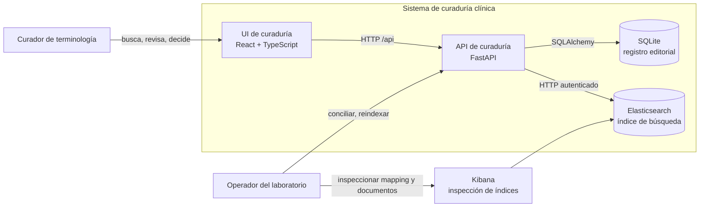
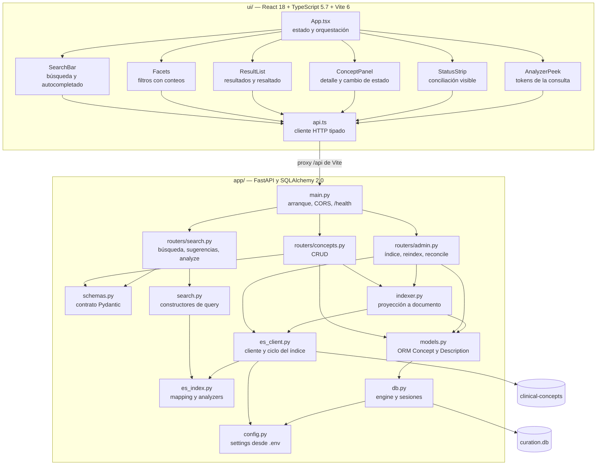
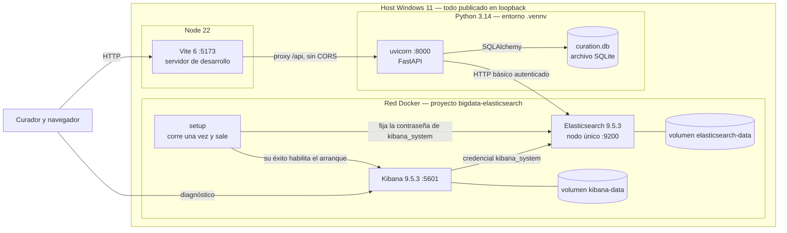
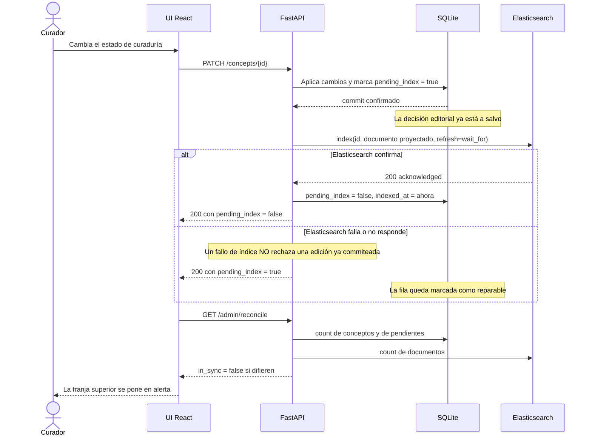
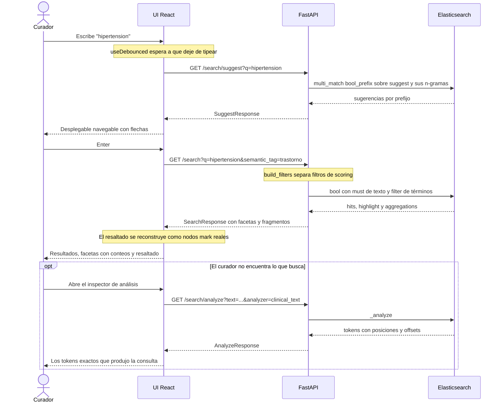
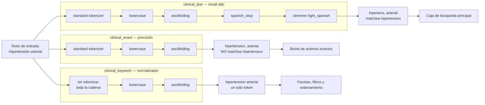
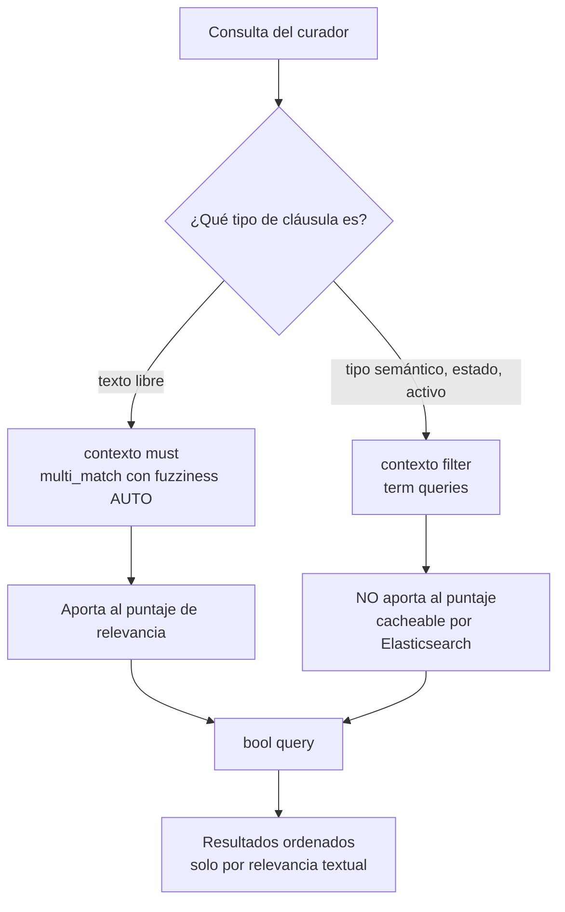
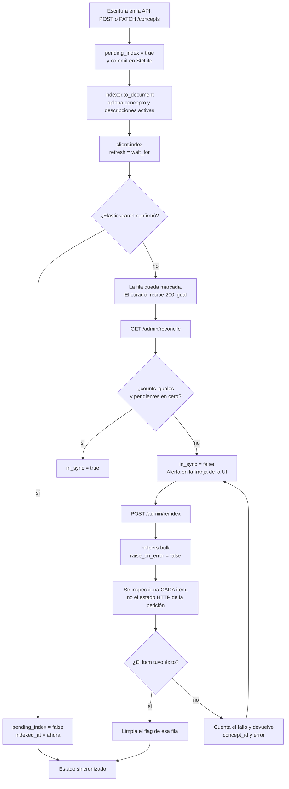
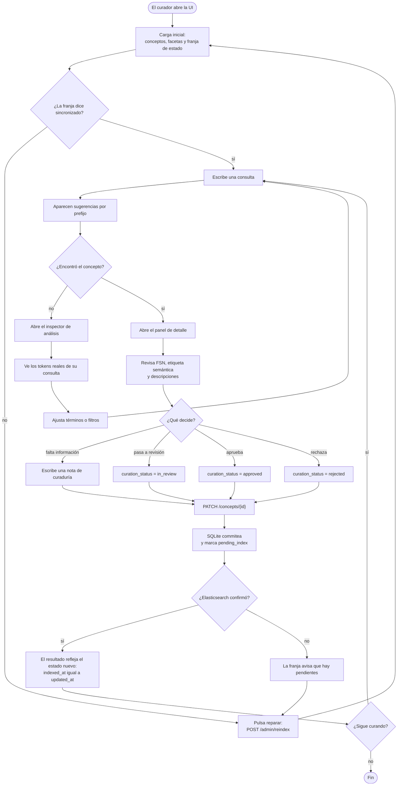
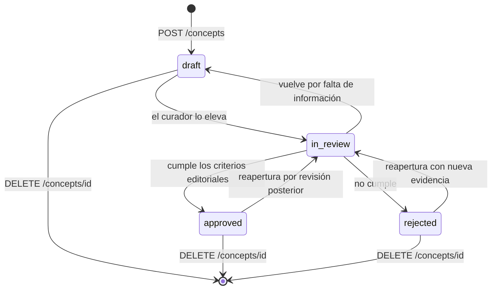

# Arquitectura del sistema

Actualizado el 2026-09-06.

Un solo sistema: **curaduría de terminología clínica**. Un servicio FastAPI sobre dos
almacenes — SQLite guarda la decisión editorial, Elasticsearch guarda una proyección
buscable de esa decisión — con una interfaz React para el curador.

Todo lo que se dibuja acá existe y corre. No hay diagramas de intención en este
documento: lo propuesto y no construido vive en el
[backlog de ingeniería](engineering-backlog.md).

| Documento | Qué contiene |
|---|---|
| Este | Contexto, componentes, despliegue, secuencias, pipelines, flujo de curaduría |
| [data-model.md](data-model.md) | DER, esquema físico y el documento de Elasticsearch |
| [curation-api.md](curation-api.md) | Endpoints, diseño del índice, ejemplos |
| [curation-ui.md](curation-ui.md) | Componentes de la UI y decisiones de frontend |
| [prd.md](prd.md) | Requisitos y criterios de aceptación |

---

## 1. Contexto

Quién usa el sistema y contra qué habla.



El curador nunca habla con Elasticsearch directamente. Kibana es una herramienta de
diagnóstico para el operador, no parte del camino del producto.

---

## 2. Componentes

Qué módulo hace qué, y quién depende de quién.



Tres separaciones deliberadas:

- **`schemas.py` no es `models.py`.** La forma de la base y la forma del cable cambian
  por motivos distintos. Mezclarlas obliga a versionar la API cada vez que se agrega una
  columna.
- **`search.py` no habla con la base.** Construye cuerpos de consulta; el router los
  ejecuta. Los constructores se pueden testear sin Elasticsearch arriba.
- **`indexer.py` es el único que sabe proyectar.** Un solo lugar decide cómo una fila se
  convierte en documento, así que el mapping y la proyección no pueden divergir en
  silencio.

---

## 3. Despliegue

Verificado el 2026-09-06 de punta a punta: navegador → Vite → FastAPI → SQLite y
Elasticsearch.



Notas de despliegue que importan:

- **La API no está en contenedor.** Corre en el host contra el Elasticsearch de Docker.
  Es lo cómodo para desarrollar con recarga; empaquetarla es trabajo pendiente.
- **Vite redirige `/api/*` y saca el prefijo.** El navegador ve un solo origen, así que
  no hay CORS en desarrollo. Es también la forma en que un reverse proxy serviría a los
  dos en producción.
- **Elasticsearch: 4 GiB de límite, heap de JVM de 2 GiB.** Kibana: 2 GiB, heap de Node
  de 1.5 GiB. Los volúmenes nombrados sobreviven a `docker compose down`; `down -v` los
  borra.
- **Solo HTTP, solo loopback.** No es una plantilla de producción. Ver
  [local-stack.md](local-stack.md).
- Nada de la capa Python es específico de SQLite: pasar a PostgreSQL es cambiar
  `database_url` e instalar el driver.

---

## 4. Camino de escritura: dos almacenes, una decisión

El problema central del sistema. Una edición tiene que llegar a dos lugares y el segundo
puede fallar.



Cuatro decisiones que vale la pena entender:

1. **La fila se marca sucia ANTES de indexar.** Si el proceso muere entre los dos pasos,
   queda evidencia. Marcarla después dejaría deriva invisible, que es el peor de los
   estados: incorrecto y silencioso.
2. **Un fallo de indexación no rechaza la edición.** El curador ya decidió. Perder esa
   decisión por una caída de Elasticsearch es peor que servir un índice atrasado un rato.
3. **`refresh=wait_for` en vez de `refresh=true`.** Espera al refresh natural en lugar de
   forzar uno. La escritura es visible cuando responde, sin castigar al índice con un
   refresh por documento.
4. **La desincronización se muestra, no se esconde.** `StatusStrip` la pone en la cara
   del curador en vez de dejar que la descubra por una búsqueda que calladamente devuelve
   de menos.

---

## 5. Camino de lectura: de la tecla al resultado



**Las respuestas viejas se descartan.** Cada efecto de la UI lleva una bandera
`cancelled`: si la respuesta lenta de una consulta anterior llega después de una nueva,
se tira. Sin eso, escribís rápido y la pantalla te muestra el resultado de hace tres
letras.

El resaltado **nunca** usa `dangerouslySetInnerHTML`. Elasticsearch devuelve los
fragmentos con `<mark>` ya insertado, y ese fragmento contiene texto que cargó un
curador. Inyectarlo como HTML crudo es un agujero de XSS a cambio de una palabra en
negrita.

---

## 6. Pipeline de análisis de texto

Acá se decide si una búsqueda encuentra algo. El mismo texto se trata de tres formas
distintas, a propósito.



Por qué las tres:

- **`asciifolding` no es un detalle.** Los curadores escriben "hipertension" sin tilde
  todo el tiempo. Sin folding, esas consultas devolverían cero en silencio.
- **El stemming sube el recall y baja la precisión.** `clinical_text` colapsa
  "hipertensión" e "hipertensivo" en la misma raíz. Eso encuentra más, pero también
  encuentra cosas que no son exactamente lo que pediste.
- **`clinical_exact` recupera la precisión con boosts.** Un acierto sin stemmear pesa más
  (`fsn.exact^6`) que uno stemmeado (`fsn^4`), así que lo exacto sube al tope sin perder
  lo aproximado.
- **El normalizador no es un analyzer.** No parte el texto: produce un único token con
  toda la cadena. Es lo que hace que una faceta diga "estructura corporal" y no
  "estructura" + "corporal".

Boosts completos, de mayor a menor: `fsn.exact^6`, `preferred_term.exact^5`, `fsn^4`,
`preferred_term^3`, `terms.exact^2`, `terms^1`. Un acierto exacto le gana a uno
stemmeado, y el nombre completamente especificado le gana a un sinónimo.

### Filtros versus scoring



Un filtro responde sí o no. No debe influir en qué tan relevante es un documento.
Mezclar las dos cosas es la forma clásica de terminar con rankings sin explicación. Hay
un test que fija esa regla: `test_filters_do_not_change_the_score` compara los puntajes
con y sin filtro y exige que sean idénticos.

---

## 7. Pipeline de indexación y conciliación

Cómo una fila relacional termina siendo un documento buscable, y cómo se repara cuando
no llega.



**Una petición bulk puede devolver HTTP 200 con documentos fallados adentro.** Reportar
la petición como exitosa sería mentir. Por eso `reindex_pending` clasifica item por item
y solo limpia el flag de las filas que Elasticsearch aceptó de verdad.

`POST /admin/reindex?only_pending=false` reconstruye todos los documentos. Es lo que se
corre después de cambiar el mapping — junto con `scripts/seed.py --reset`, porque los
analyzers y los tipos de campo son inmutables una vez creado el índice.

El contrato de conciliación, en una línea:

```
conceptos_en_base == documentos_en_indice   cuando   pending_index == 0
```

---

## 8. Flujo de trabajo de curaduría

Lo que hace una persona, de punta a punta.



El camino "no lo encontré → miro los tokens → entiendo por qué" es el que convierte a la
búsqueda de caja negra en algo diagnosticable. Es la razón de que `/search/analyze` sea
un endpoint de producto y no una herramienta de debug escondida.

---

## 9. Estados de curaduría



**Honestidad sobre esta máquina de estados: hoy no está forzada en código.** Los cuatro
valores de `curation_status` se validan contra el `Literal` de Pydantic, pero cualquier
transición entre ellos se acepta. Las flechas de arriba son la política editorial
prevista, no una invariante del sistema. Forzarla es trabajo pendiente y está en el
[backlog](engineering-backlog.md).

`active` es un eje distinto de `curation_status`: un concepto aprobado puede quedar
inactivo cuando se retira de uso. En SNOMED CT nada se borra, se inactiva. Este modelo
conserva esa idea aunque permita `DELETE` para la limpieza del laboratorio.

---

## 10. Modelo de datos

El DER, el esquema físico y el documento de Elasticsearch viven en
[data-model.md](data-model.md), con la correspondencia campo a campo entre las dos
representaciones.

---

## 11. Límites conocidos de esta arquitectura

- **La indexación es sincrónica.** El paso a Elasticsearch ocurre dentro del request. Un
  sistema en producción lo movería a un worker que consume una tabla de outbox: la
  historia de recuperación es la misma, cambia quién ejecuta el paso.
- **SQLite tiene un solo escritor a la vez.** Alcanza para un curador. Con escrituras
  concurrentes aparece `database is locked`; ese es el momento de PostgreSQL.
- **Sin autenticación en la API.** Cualquiera que llegue a la página puede cambiar
  estados. Es local; poner auth antes de exponerlo a otra máquina.
- **Un solo nodo, cero réplicas.** No se puede demostrar tolerancia a fallos distribuida
  con esta topología, y un experimento multinodo en la misma máquina sigue compartiendo
  el dominio de falla del host.
- **Sin migraciones.** `create_all()` alcanza para arrancar. Alembic va antes del primer
  cambio de esquema sobre datos que importen.

El listado completo con prioridades está en el
[backlog de ingeniería](engineering-backlog.md).
