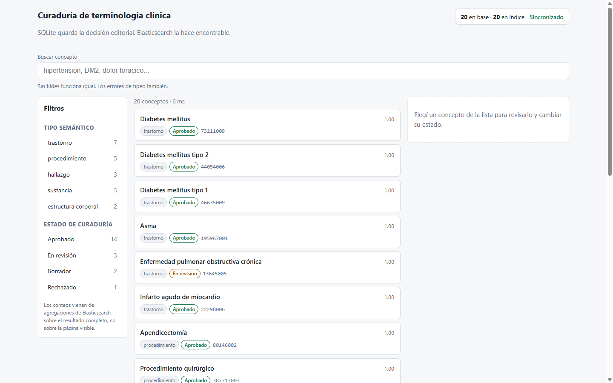
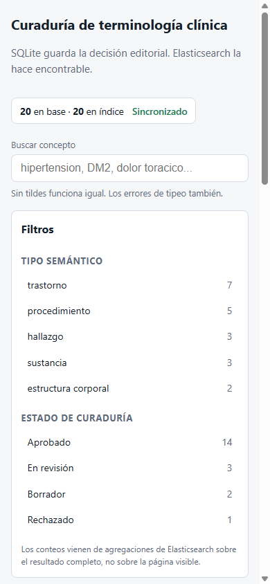

# UI de curaduría (React + TypeScript)

Interfaz para revisar conceptos clínicos y cambiar su estado de curaduría. Consume
la [API de curaduría](curation-api.md). Sin librerías de UI, sin fuentes externas,
sin tracking: React, TypeScript y CSS a mano.

Verificado el 2026-09-06 en navegador real contra el stack completo.



## Levantar

Hacen falta tres cosas corriendo, en este orden:

```powershell
# 1. Elasticsearch + Kibana
docker compose up -d --pull never

# 2. API (en una terminal)
.\.vennv\Scripts\python.exe -m uvicorn app.main:app --reload

# 3. UI (en otra terminal)
cd ui
npm install
npm run dev
```

Abrí <http://localhost:5173>.

Ojo con la dirección: Vite escucha en `localhost`, que en Windows resuelve a IPv6.
`http://127.0.0.1:5173` puede no responder aunque el servidor esté arriba.

## Por qué hay un proxy

`vite.config.ts` redirige `/api/*` a `http://127.0.0.1:8000` y saca el prefijo.

El navegador ve un solo origen, así que **no hay CORS en desarrollo**. Es también
cómo lo servirías en producción, con un reverse proxy adelante de los dos.

La API igual declara CORS para `localhost:5173`, por si alguien prefiere pegarle
directo. Las dos rutas funcionan; el proxy tiene menos partes móviles.

## Qué hace

| Componente | Responsabilidad |
|---|---|
| `SearchBar` | Búsqueda con autocompletado por prefijo, navegable con flechas y Enter |
| `AnalyzerPeek` | Muestra en qué tokens se parte tu consulta, con los dos analyzers |
| `Facets` | Filtros por tipo semántico y estado, con conteos de las agregaciones |
| `ResultList` | Resultados con puntaje, chips de estado y fragmento resaltado |
| `ConceptPanel` | Detalle: descripciones, cambio de estado y nota. Guarda con `PATCH` |
| `StatusStrip` | Conteo relacional vs indexado. Botón de reparación si divergen |

## Tres decisiones que vale la pena mirar

### 1. El resaltado no usa `dangerouslySetInnerHTML`

Elasticsearch devuelve los fragmentos con `<mark>` ya insertado. Lo tentador es
volcarlos como HTML crudo. No lo hacemos.

Ese fragmento contiene texto que cargó un curador. Inyectarlo como HTML es un
agujero de XSS a cambio de una palabra en negrita. `ResultList` parte el fragmento
por la etiqueta y reconstruye elementos `<mark>` reales.

### 2. Debounce, y descarte de respuestas viejas

Cada tecla sería una consulta a Elasticsearch. `useDebounced` espera a que dejes de
escribir.

Además, cada efecto lleva una bandera `cancelled`: si una respuesta lenta de una
consulta vieja llega después de una nueva, se descarta. Sin eso, escribís rápido y
la pantalla te muestra el resultado de hace tres letras.

### 3. La desincronización se muestra, no se esconde

`StatusStrip` compara cuántos conceptos hay en la base contra cuántos documentos hay
en el índice. Si no coinciden, la franja se pone en alerta y ofrece reparar.

Es el problema de los dos almacenes, puesto en la cara del curador en vez de
descubrirlo por una búsqueda que calladamente devuelve de menos.

## Verificación ejecutada (2026-09-06)

Build con TypeScript en modo estricto (`strict`, `noUncheckedIndexedAccess`,
`noUnusedLocals`, `noUnusedParameters`):

```console
$ npm run build
✓ 36 modules transformed.
dist/assets/index-DtG5C2Od.js   157.37 kB │ gzip: 50.73 kB
✓ built in 784ms
```

En navegador, contra el stack real:

| Comprobación | Resultado |
|---|---|
| Carga inicial | 20 conceptos, franja "20 en base · 20 en índice · Sincronizado" |
| Facetas | trastorno 7, procedimiento 5, hallazgo 3, sustancia 3, estructura corporal 2 |
| Buscar `hipertension` sin tilde | 1 resultado, puntaje 13.82, con `<mark>hipertensivo</mark>` |
| Facetas tras filtrar | se recalculan al subconjunto (trastorno 1, Aprobado 1) |
| Filtro por tipo semántico | 5 procedimientos, facetas de estado recalculadas |
| Panel de detalle | carga las 4 descripciones con sus flags |
| `PATCH` de estado | guardó, reindexó, y `indexed_at` quedó igual a `updated_at` |
| Responsive 390px | una columna, sin desborde horizontal |
| Consola | sin errores (el 404 de favicon se corrigió) |

El `PATCH` es el que más importa: confirma el camino completo de escritura.
La marca de tiempo de indexación coincidiendo con la de actualización es la
evidencia de que Elasticsearch confirmó antes de limpiar el flag.



## Accesibilidad: hasta dónde llega

Hecho: el autocompletado usa `role="combobox"`/`listbox`/`option` con
`aria-expanded` y `aria-selected`, se navega con flechas, Enter y Escape. Los
filtros son `<button>` con `aria-pressed`. Todo control tiene foco visible. El
error de búsqueda va en un `role="alert"`.

No hecho: no se probó con un lector de pantalla real. Que el marcado sea correcto
no es lo mismo que auditarlo.

## Limitaciones

- **Sin autenticación.** Cualquiera que llegue a la página puede cambiar estados.
  Es local; poner auth antes de exponerlo.
- **Sin paginación.** Trae hasta 25 resultados y ahí queda. Con miles de conceptos
  hace falta paginar o scroll infinito.
- **No se editan descripciones.** Solo estado y nota. Agregar o corregir sinónimos
  todavía va por la API.
- **Sin tests de front.** El build tipa y verifiqué a mano en navegador, pero no hay
  suite automatizada. Vitest + Testing Library es el siguiente paso.
- **Los tipos de `types.ts` se mantienen a mano.** Se pueden generar desde el
  OpenAPI que ya publica FastAPI en `/openapi.json`.

## Próximos pasos

Priorizados, con su motivo y su señal de urgencia, en el
[backlog de ingeniería](engineering-backlog.md). Los que tocan al frontend:

1. Vitest + Testing Library sobre los componentes, y Playwright para el flujo completo.
   Lo primero a cubrir es que `ResultList` no interprete HTML del servidor: es una
   defensa de XSS y hoy nada la protege de una regresión.
2. Generar `types.ts` desde `/openapi.json` en vez de escribirlos. Hoy son dos fuentes
   de verdad para el mismo contrato y nada las obliga a coincidir.
3. Paginación o scroll infinito. La API ya soporta `limit` y `offset`.
4. Edición de descripciones y sinónimos.
5. Autenticación, antes de que esto salga de localhost.
