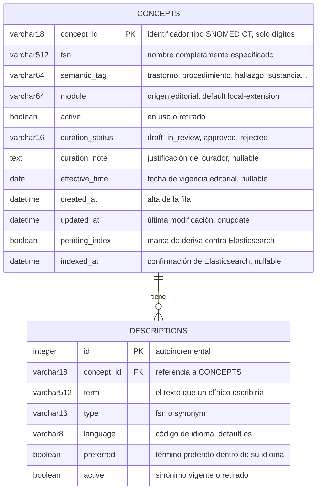
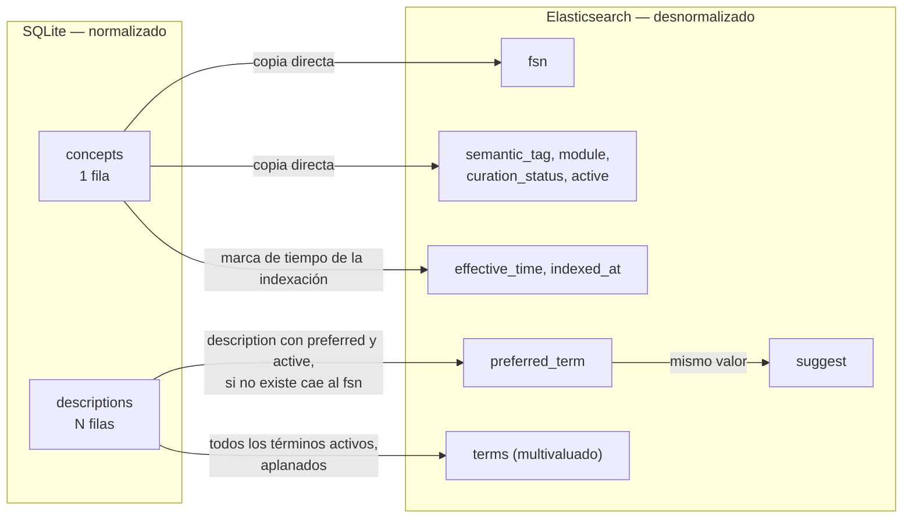

# Modelo de datos

Actualizado el 2026-09-06.

El sistema guarda la misma información de dos formas, con dos propósitos distintos:

| Almacén | Rol | Optimizado para |
|---|---|---|
| **SQLite** (`curation.db`) | Fuente de verdad editorial | Integridad, transacciones, historia de la decisión |
| **Elasticsearch** (`clinical-concepts`) | Proyección buscable | Encontrar el concepto con las palabras que el curador escribe |

Elasticsearch **no** es una base de datos acá. Es un índice derivado: si se borra
entero, se reconstruye con `POST /admin/reindex?only_pending=false`. Lo que no se puede
reconstruir es lo que vive en SQLite.

---

## 1. Diagrama de entidad-relación



### Cardinalidad y por qué

Un concepto tiene **cero o más** descripciones. Cero es legal: un concepto recién creado
por la API sin `descriptions` es válido, y `preferred_term` cae de vuelta al FSN.

La relación es la esencia del dominio. **Un concepto clínico no es una palabra: es una
idea con muchos nombres.** "Diabetes mellitus tipo 2", "DM2" y "Diabetes no
insulinodependiente" son tres descripciones del mismo concepto `44054006`. Si el modelo
guardara un solo nombre por concepto, buscar "DM2" no encontraría nada, y ese es
exactamente el caso de uso.

Es una simplificación didáctica de SNOMED CT, no un formato de release. SNOMED CT real
tiene además relaciones concepto-concepto (`is a`, `finding site`, etc.), refsets y
versionado por `effectiveTime`. Nada de eso está modelado acá.

---

## 2. Esquema físico

DDL real, generado desde los metadatos de SQLAlchemy:

```sql
CREATE TABLE concepts (
    concept_id      VARCHAR(18) NOT NULL,
    fsn             VARCHAR(512) NOT NULL,
    semantic_tag    VARCHAR(64) NOT NULL,
    module          VARCHAR(64) NOT NULL,
    active          BOOLEAN NOT NULL,
    curation_status VARCHAR(16) NOT NULL,
    curation_note   TEXT,
    effective_time  DATE,
    created_at      DATETIME NOT NULL,
    updated_at      DATETIME NOT NULL,
    pending_index   BOOLEAN NOT NULL,
    indexed_at      DATETIME,
    PRIMARY KEY (concept_id)
);

CREATE INDEX ix_concepts_semantic_tag    ON concepts (semantic_tag);
CREATE INDEX ix_concepts_curation_status ON concepts (curation_status);
CREATE INDEX ix_concepts_active          ON concepts (active);
CREATE INDEX ix_concepts_pending_index   ON concepts (pending_index);

CREATE TABLE descriptions (
    id         INTEGER NOT NULL,
    concept_id VARCHAR(18) NOT NULL,
    term       VARCHAR(512) NOT NULL,
    type       VARCHAR(16) NOT NULL,
    language   VARCHAR(8) NOT NULL,
    preferred  BOOLEAN NOT NULL,
    active     BOOLEAN NOT NULL,
    PRIMARY KEY (id),
    FOREIGN KEY (concept_id) REFERENCES concepts (concept_id) ON DELETE CASCADE
);

CREATE INDEX ix_descriptions_concept_id ON descriptions (concept_id);
```

### Decisiones del esquema

**`concept_id` es la clave primaria, no un autoincremental.** El identificador viene del
dominio: es un ID tipo SNOMED CT, validado contra `^\d+$` en el schema de entrada. Meterle
una PK sintética al lado obligaría a mantener dos identidades para la misma cosa.

**Los cuatro índices de `concepts` no son decorativos.** `GET /concepts` filtra
exactamente por `curation_status`, `semantic_tag` y `pending_index`; `active` se usa al
proyectar. Cada índice existe porque hay una consulta que lo recorre.

**`pending_index` e `indexed_at` no son metadatos de auditoría.** Son el mecanismo de
consistencia entre los dos almacenes. La fila se marca sucia antes de indexar y solo se
limpia cuando Elasticsearch confirma. Ver el
[camino de escritura](architecture.md#4-camino-de-escritura-dos-almacenes-una-decisión).

**`created_at` y `updated_at` son ingenuos, sin zona horaria.** El código escribe UTC
(`datetime.now(timezone.utc)`), pero la columna es `DATETIME` y SQLite no guarda el
offset. Los valores son UTC por convención del código, no por garantía del esquema. Al
pasar a PostgreSQL, esas columnas deberían ser `TIMESTAMPTZ`.

### Gotcha verificada: la FK no se aplica

```console
$ PRAGMA foreign_keys;
0
```

SQLite trae la comprobación de claves foráneas **apagada por defecto**, y este proyecto
no la enciende. El `ON DELETE CASCADE` del DDL está declarado pero no actúa.

Hoy no rompe nada porque el borrado en cascada lo hace el ORM: la relación declara
`cascade="all, delete-orphan"`, así que `session.delete(concept)` elimina también sus
descripciones. Pero eso significa que **la integridad depende de que todo pase por
SQLAlchemy**. Un `DELETE` en SQL crudo dejaría descripciones huérfanas sin protestar.

Arreglo: un listener de `connect` que ejecute `PRAGMA foreign_keys=ON`. Está en el
[backlog](engineering-backlog.md).

### Restricciones que el esquema NO tiene

Vale la pena ser explícito sobre lo que no está forzado en la base:

| Regla | Dónde vive hoy | Dónde debería vivir |
|---|---|---|
| `curation_status` en cuatro valores | `Literal` de Pydantic | `CHECK` en la base |
| `type` en `fsn` o `synonym` | `Literal` de Pydantic | `CHECK` en la base |
| Un solo `preferred` activo por idioma | En ningún lado | Índice único parcial |
| Transiciones válidas de estado | En ningún lado | Capa de servicio |

La validación de Pydantic protege la puerta HTTP. No protege un script que abra la base
directamente. Para un laboratorio alcanza; para datos que importen, no.

---

## 3. El documento de Elasticsearch

La misma información, aplanada para buscarla. `dynamic: strict`: un campo no declarado
hace fallar la indexación en vez de inventar un tipo.

```json
{
  "concept_id": "44054006",
  "fsn": "Diabetes mellitus tipo 2 (trastorno)",
  "preferred_term": "Diabetes mellitus tipo 2",
  "terms": ["Diabetes mellitus tipo 2", "Diabetes tipo 2", "DM2",
            "Diabetes no insulinodependiente"],
  "suggest": "Diabetes mellitus tipo 2",
  "semantic_tag": "trastorno",
  "module": "local-extension",
  "curation_status": "approved",
  "active": true,
  "effective_time": null,
  "indexed_at": "2026-09-06T22:40:45.688362+00:00"
}
```

### Correspondencia relacional → documento



Cuatro cosas de esta proyección merecen atención:

**`terms` aplana la relación entera en un campo multivaluado.** Es lo que permite buscar
"todas las formas en que un clínico podría nombrar el concepto" con una sola cláusula.
Cuando la lista queda vacía, se cae de vuelta al FSN para que el documento nunca sea
inbuscable.

**Solo entran las descripciones activas.** Un sinónimo retirado deja de encontrarse en
la búsqueda pero sigue en SQLite, que es donde vive la historia editorial.

**`suggest` es un campo de primer nivel, no un multi-field.** El tipo
`search_as_you_type` genera sus propios subcampos `._2gram` y `._3gram`, y eso no es
legal dentro de un multi-field.

**Los campos derivados no se guardan en SQLite.** `preferred_term` es una `@property` de
Python que se calcula al proyectar. Persistirla sería una tercera copia que puede
desincronizarse de las otras dos.

### Tipos y por qué cada uno

| Campo | Tipo | Motivo |
|---|---|---|
| `concept_id` | `keyword` | Identidad exacta, nunca se analiza |
| `fsn`, `preferred_term` | `text` + `.exact` + `.raw` | Buscable de tres maneras: stemmeado, exacto y como token único |
| `terms` | `text` + `.exact` | Buscable, pero no hace falta facetarlo |
| `suggest` | `search_as_you_type` | Autocompletado por prefijo con n-gramas |
| `semantic_tag`, `module`, `curation_status` | `keyword` | Facetas y filtros exactos |
| `active` | `boolean` | Filtro binario |
| `effective_time`, `indexed_at` | `date` | Filtrado y ordenamiento temporal |

El detalle de los analyzers y los boosts está en el
[pipeline de análisis](architecture.md#6-pipeline-de-análisis-de-texto).

---

## 4. El fixture

`seed/concepts.json` trae **20 conceptos** clínicos en castellano, distribuidos así:

| Etiqueta semántica | Conceptos |
|---|---|
| trastorno | 7 |
| procedimiento | 5 |
| hallazgo | 3 |
| sustancia | 3 |
| estructura corporal | 2 |

Está armado para ejercitar los casos difíciles de búsqueda a propósito: tres diabetes
distintas (para probar tolerancia a errores de tipeo), acrónimos que no aparecen en el
FSN (`EPOC`, `DM2`, `IAM`), y términos con tilde que los curadores escriben sin ella.

**No es una distribución de SNOMED CT.** SNOMED CT requiere licencia de SNOMED
International para redistribuirse. Este fixture es un subconjunto ilustrativo escrito
para el laboratorio.

Cargarlo:

```powershell
.\.vennv\Scripts\python.exe -m scripts.seed --reset
```

`--reset` borra el índice y vacía las tablas antes de cargar. Es la única forma de
aplicar un mapping modificado: los analyzers y los tipos de campo son inmutables una vez
creado el índice.
